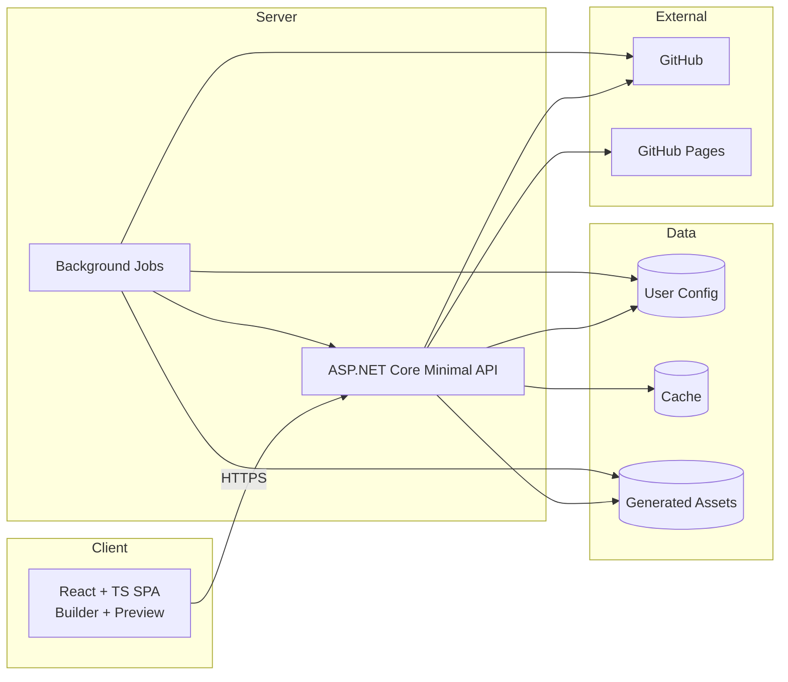
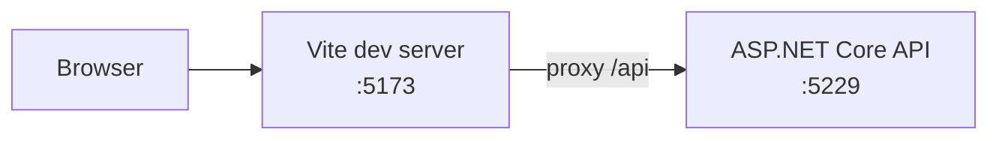

# Architecture Diagrams (Mermaid)

These diagrams describe the target architecture. The codebase may lag behind the target.

## System context

```mermaid
flowchart TB
  user[Developer]
  ui[Profily Web UI\n(React + TS)]
  api[Profily API\n(ASP.NET Core)]
  gh[GitHub APIs]
  pages[GitHub Pages]
  jobs[Background Jobs\n(Azure Functions or equivalent)]
  data[(User Data Store)]
  cache[(Cache)]
  assets[(Asset Storage)]

  user --> ui
  ui --> api
  api --> gh
  api --> data
  api --> cache
  api --> assets
  api --> pages
  jobs --> api
  jobs --> gh
  jobs --> data
  jobs --> assets
```

## Containers



## Local development (current)


