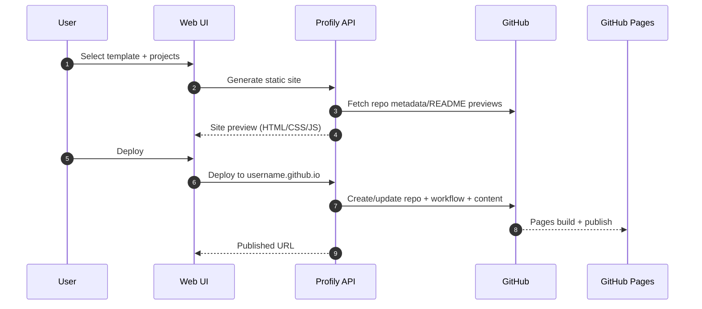

# Flow: Portfolio Build + GitHub Pages Deploy (Target)

## Sequence

```mermaid
sequenceDiagram
  autonumber
  participant U as User
  participant UI as Web UI
  participant API as Profily API
  participant GH as GitHub
  participant P as GitHub Pages

  U->>UI: Select template + projects
  UI->>API: Generate static site
  API->>GH: Fetch repo metadata/README previews
  API-->>UI: Site preview (HTML/CSS/JS)
  U->>UI: Deploy
  UI->>API: Deploy to username.github.io
  API->>GH: Create/update repo + workflow + content
  GH-->>P: Pages build + publish
  API-->>UI: Published URL
```

## Notes

- Output: static site files.
- Deployment: GitHub Pages via repo settings/workflow.
