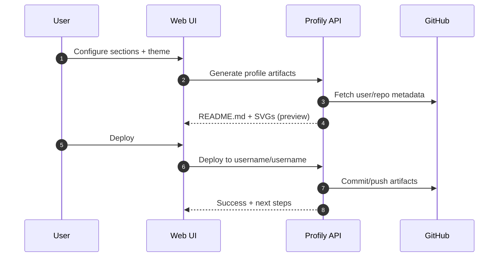

# Flow: Profile Generation + Deploy (Target)

## Sequence

```mermaid
sequenceDiagram
  autonumber
  participant U as User
  participant UI as Web UI
  participant API as Profily API
  participant GH as GitHub

  U->>UI: Configure sections + theme
  UI->>API: Generate profile artifacts
  API->>GH: Fetch user/repo metadata
  API-->>UI: README.md + SVGs (preview)
  U->>UI: Deploy
  UI->>API: Deploy to username/username
  API->>GH: Commit/push artifacts
  API-->>UI: Success + next steps
```

## Notes

- Output: README + SVG assets.
- Deployment: commit to the user’s profile repo.
