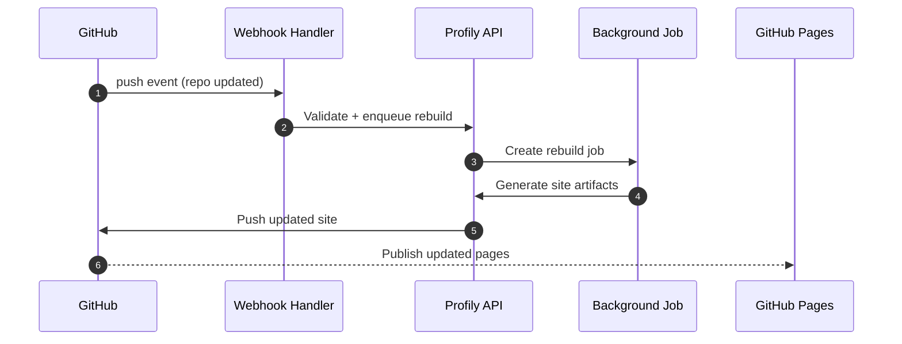

# Flow: Webhook-driven Rebuild (Target)

## Sequence

```mermaid
sequenceDiagram
  autonumber
  participant GH as GitHub
  participant WH as Webhook Handler
  participant API as Profily API
  participant JOB as Background Job
  participant P as GitHub Pages

  GH->>WH: push event (repo updated)
  WH->>API: Validate + enqueue rebuild
  API->>JOB: Create rebuild job
  JOB->>API: Generate site artifacts
  API->>GH: Push updated site
  GH-->>P: Publish updated pages
```

## Notes

- Trigger sources: repo push events, manual dispatch, scheduled jobs.
