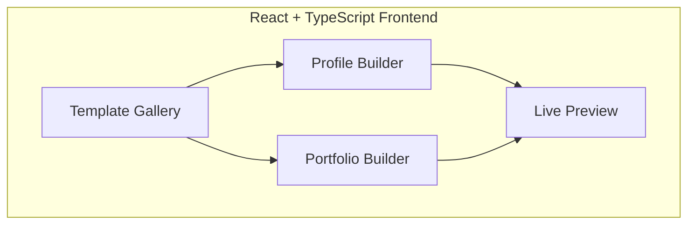
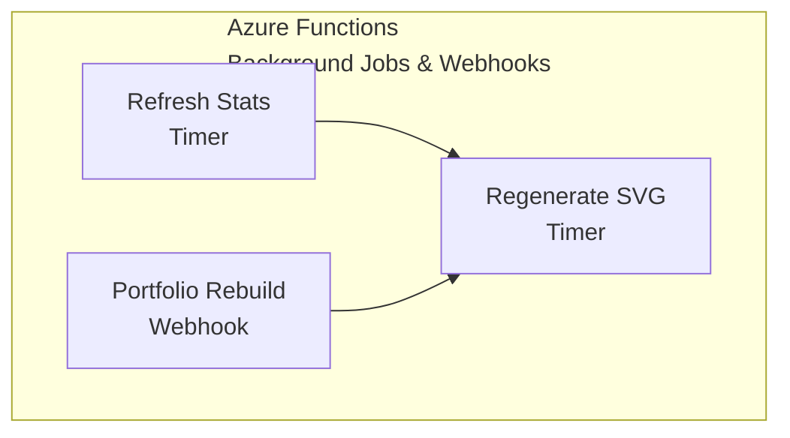

# 🚀 Profily - GitHub Identity Platform

> A .NET-powered platform that generates stunning GitHub profiles AND beautiful portfolio websites, auto-deployed to GitHub Pages.

<div align="center">


[Live Demo](https://profily.azurewebsites.net) • [Documentation](docs/) • [Report Bug](issues)

</div>

---

## 🎯 Two Products, One Platform

| Feature | 📋 Profile Generator | 🌐 Portfolio Generator |
|---------|----------------------|------------------------|
| **Output** | README.md + Dynamic SVGs | Full Static Website |
| **Deploy To** | `username/username` repo | GitHub Pages (`username.github.io`) |
| **Content** | Stats, Snake, Badges, Tech Stack | Projects, About, Resume, Blog |
| **Updates** | GitHub Actions (scheduled) | On-demand + Webhooks |
| **Tech Detection** | Yes (via Octokit) | Yes + dependency parsing |

---

## ✨ Features

### 📋 Profile Generator
- 🎨 **Multiple Themes** - Dark, Light, Cyberpunk, Monochrome, Neon
- 🐍 **Animated Snake** - Contribution graph snake animation
- 📊 **Dynamic Stats** - Real-time GitHub statistics
- 🎯 **Drag & Drop Builder** - Visual profile editor
- ⚡ **One-Click Deploy** - Direct push to your GitHub profile
- 🔄 **Auto-Updates** - GitHub Actions workflows included

### 🌐 Portfolio Generator
- 🎯 **Repo Selector** - Choose which repositories to showcase (with search, filter, sort)
- 📁 **Smart Import** - Fetches repos with stars, languages, descriptions, README previews
- ⭐ **Project Customization** - Override titles, descriptions, add custom images/links
- 🎨 **Stunning Templates** - Modern, minimal, developer-focused designs
- 📝 **Markdown Blog** - Auto-sync from user's blog repo or gists
- 📄 **Resume Section** - JSON Resume format support
- 🚀 **GitHub Pages Deploy** - Automatic CI/CD pipeline generation
- 🔗 **Custom Domain** - Support for personal domains (CNAME)
- 📱 **Mobile Responsive** - All templates are mobile-first
- 🔍 **SEO Optimized** - Meta tags, sitemap, Open Graph

---

## 🏗️ Architecture

Canonical, maintained diagrams live in:

- `docs/architecture/overview.md`
- `docs/architecture/diagrams.md`

Below are lightweight Mermaid diagrams for the same idea (easier to update than ASCII).

### Frontend (React + TypeScript)



### API (ASP.NET Core)

```mermaid
flowchart TB
  subgraph API[ASP.NET Core 8 Web API]
    svg[SVG Generator\n(SkiaSharp)]
    gh[GitHub API Service\n(Octokit)]
    tmpl[Template Engine\n(Scriban)]
    site[Site Generator\n(Static HTML)]
    dep1[Profile Deployer\n(push to username/username)]
    dep2[Pages Deployer\n(GitHub Pages)]
  end
  tmpl --> site
  gh --> tmpl
  gh --> svg
  site --> dep2
  tmpl --> dep1
```

### Background Jobs (Azure Functions)



### Data & Storage

```mermaid
flowchart TB
  subgraph Data[Data & Storage]
    db[Cosmos DB\n(User Data)]
    cache[Redis\n(API Cache)]
    blob[Blob Storage\n(Generated Assets)]
  end
  db <--> cache
  db --> blob
```

---

## 🛠️ Tech Stack

| Layer | Technology |
|-------|------------|
| **Frontend** | React 18, TypeScript 5, TailwindCSS, Zustand, React Query |
| **Backend API** | ASP.NET Core 8 Minimal APIs |
| **SVG Generation** | SkiaSharp, Svg.Skia |
| **Static Site Generation** | Scriban Templates → HTML/CSS/JS |
| **Authentication** | GitHub OAuth (Octokit.NET) |
| **Database** | Azure Cosmos DB |
| **Caching** | Redis (StackExchange.Redis) |
| **File Storage** | Azure Blob Storage |
| **Background Jobs** | Azure Functions (Timer + HTTP Triggers) |
| **Hosting** | Azure Container Apps |
| **CI/CD** | GitHub Actions |

---

## 📁 Project Structure

```
📦 Profily/
├── 📂 src/
│   ├── 📂 profily-web/                    # React + TypeScript Frontend
│   │   ├── 📂 src/
│   │   │   ├── 📂 components/
│   │   │   │   ├── 📂 profile/
│   │   │   │   │   ├── ProfileBuilder.tsx  # Profile drag-drop builder
│   │   │   │   │   ├── ThemeSelector.tsx   # Theme picker
│   │   │   │   │   └── SectionEditor.tsx   # Section customization
│   │   │   │   ├── 📂 portfolio/
│   │   │   │   │   ├── PortfolioBuilder.tsx# Portfolio editor
│   │   │   │   │   ├── ProjectPicker.tsx   # Select repos to showcase
│   │   │   │   │   ├── ResumeEditor.tsx    # JSON Resume editor
│   │   │   │   │   └── TemplateGallery.tsx # Portfolio templates
│   │   │   │   └── 📂 shared/
│   │   │   │       ├── LivePreview.tsx     # Real-time preview
│   │   │   │       └── DeployButton.tsx    # One-click deploy
│   │   │   ├── 📂 hooks/
│   │   │   │   ├── useProfile.ts           # Profile state management
│   │   │   │   ├── usePortfolio.ts         # Portfolio state management
│   │   │   │   └── useGitHub.ts            # GitHub API hooks
│   │   │   ├── 📂 services/
│   │   │   │   └── api.ts                  # API client (axios/fetch)
│   │   │   ├── 📂 store/
│   │   │   │   └── index.ts                # Zustand store
│   │   │   └── main.tsx
│   │   ├── package.json
│   │   ├── tsconfig.json
│   │   └── vite.config.ts
│   │
│   ├── 📂 Profily.Api/                    # ASP.NET Core API
│   │   ├── 📂 Endpoints/
│   │   │   ├── AuthEndpoints.cs            # GitHub OAuth
│   │   │   ├── ProfileEndpoints.cs         # Profile CRUD & Deploy
│   │   │   ├── PortfolioEndpoints.cs       # Portfolio CRUD & Deploy
│   │   │   ├── GitHubEndpoints.cs          # GitHub API proxy
│   │   │   ├── SvgEndpoints.cs             # SVG generation
│   │   │   └── TemplateEndpoints.cs        # Template management
│   │   ├── 📂 Services/
│   │   │   ├── SvgGeneratorService.cs      # Dynamic SVG creation
│   │   │   ├── GitHubService.cs            # GitHub API wrapper
│   │   │   ├── TechStackService.cs         # Language/stack detection
│   │   │   ├── TemplateService.cs          # README & HTML templating
│   │   │   ├── SiteGeneratorService.cs     # Static site builder
│   │   │   ├── ProfileDeployService.cs     # Push to profile repo
│   │   │   └── PagesDeployService.cs       # Deploy to GitHub Pages
│   │   └── Program.cs
│   │
│   ├── 📂 Profily.Core/                   # Domain & Shared
│   │   ├── 📂 Models/
│   │   │   ├── 📂 Profile/
│   │   │   │   ├── UserProfile.cs
│   │   │   │   ├── ProfileSection.cs
│   │   │   │   └── ProfileTheme.cs
│   │   │   ├── 📂 Portfolio/
│   │   │   │   ├── Portfolio.cs
│   │   │   │   ├── Project.cs
│   │   │   │   ├── Resume.cs               # JSON Resume model
│   │   │   │   ├── BlogPost.cs
│   │   │   │   └── PortfolioTheme.cs
│   │   │   └── 📂 GitHub/
│   │   │       ├── GitHubUser.cs
│   │   │       ├── GitHubStats.cs
│   │   │       ├── Repository.cs
│   │   │       └── TechStack.cs
│   │   ├── 📂 Interfaces/
│   │   │   ├── ISvgGenerator.cs
│   │   │   ├── IGitHubService.cs
│   │   │   ├── ITechStackService.cs
│   │   │   ├── ISiteGenerator.cs
│   │   │   └── IDeploymentService.cs
│   │   └── 📂 Templates/
│   │       ├── 📂 Profile/
│   │       │   ├── header.scriban
│   │       │   ├── stats.scriban
│   │       │   └── readme.scriban
│   │       └── 📂 Portfolio/
│   │           ├── 📂 developer-dark/      # Template 1
│   │           │   ├── index.html
│   │           │   ├── projects.html
│   │           │   ├── resume.html
│   │           │   └── styles.css
│   │           ├── 📂 minimal-light/       # Template 2
│   │           ├── 📂 creative-gradient/   # Template 3
│   │           └── 📂 terminal-style/      # Template 4
│   │
│   ├── 📂 Profily.Functions/              # Azure Functions
│   │   ├── RefreshStatsTrigger.cs          # Scheduled stats refresh
│   │   ├── RegenerateSvgTrigger.cs         # SVG regeneration
│   │   ├── RebuildPortfolioTrigger.cs      # Rebuild on repo changes
│   │   └── GitHubWebhookHandler.cs         # Handle push events
│   │
│   └── 📂 Profily.Infrastructure/         # Data & External
│       ├── 📂 Persistence/
│       │   ├── CosmosDbContext.cs
│       │   ├── ProfileRepository.cs
│       │   └── PortfolioRepository.cs
│       ├── 📂 GitHub/
│       │   ├── OctokitGitHubService.cs
│       │   └── TechStackAnalyzer.cs        # Analyze languages & deps
│       ├── 📂 Storage/
│       │   └── BlobStorageService.cs       # Store generated assets
│       └── 📂 Caching/
│           └── RedisCacheService.cs
│
├── 📂 tests/
│   ├── 📂 Profily.Api.Tests/
│   ├── 📂 Profily.Core.Tests/
│   └── 📂 Profily.Integration.Tests/
│
├── 📂 docs/
│   ├── api-reference.md
│   ├── profile-themes.md
│   ├── portfolio-templates.md
│   └── deployment.md
│
├── 📄 docker-compose.yml
├── 📄 Profily.sln
└── 📄 README.md
```

---

## 🔍 Tech Stack Detection Service

The platform automatically detects user's tech stack from their repositories:

```csharp
public interface ITechStackService
{
    /// <summary>
    /// Analyzes all repos to determine user's tech stack
    /// </summary>
    Task<TechStack> AnalyzeUserTechStackAsync(string username);
}

public class TechStackService : ITechStackService
{
    private readonly IGitHubClient _github;

    public async Task<TechStack> AnalyzeUserTechStackAsync(string username)
    {
        var techStack = new TechStack();
        
        // 1. Get all repositories
        var repos = await _github.Repository.GetAllForUser(username);
        
        // 2. Aggregate languages from all repos (GitHub API)
        foreach (var repo in repos.Where(r => !r.Fork))
        {
            var languages = await _github.Repository.GetAllLanguages(repo.Owner.Login, repo.Name);
            foreach (var lang in languages)
            {
                techStack.Languages.AddOrUpdate(lang.Name, lang.NumberOfBytes);
            }
        }
        
        // 3. Detect frameworks by reading dependency files
        foreach (var repo in repos.Take(10)) // Top 10 repos
        {
            await DetectFrameworksAsync(repo, techStack);
        }
        
        // 4. Calculate percentages and rankings
        techStack.CalculateMetrics();
        
        return techStack;
    }
    
    private async Task DetectFrameworksAsync(Repository repo, TechStack techStack)
    {
        // Check for .NET
        if (await FileExistsAsync(repo, "*.csproj"))
        {
            var csproj = await GetFileContentAsync(repo, "*.csproj");
            techStack.Frameworks.Add(DetectDotNetFramework(csproj)); // ASP.NET, Blazor, etc.
        }
        
        // Check for Node.js
        if (await FileExistsAsync(repo, "package.json"))
        {
            var pkg = await GetFileContentAsync(repo, "package.json");
            techStack.Frameworks.AddRange(DetectNodeFrameworks(pkg)); // React, Vue, Next.js
        }
        
        // Check for Python
        if (await FileExistsAsync(repo, "requirements.txt") || 
            await FileExistsAsync(repo, "pyproject.toml"))
        {
            techStack.Frameworks.AddRange(DetectPythonFrameworks(repo));
        }
        
        // Check for Go, Rust, Java, etc.
        // ...
    }
}

public class TechStack
{
    public Dictionary<string, long> Languages { get; set; } = new();
    public List<Framework> Frameworks { get; set; } = new();
    public List<string> Tools { get; set; } = new(); // Docker, K8s, etc.
    
    // Calculated
    public List<LanguagePercentage> TopLanguages { get; set; } = new();
}
```

---

## 🌐 Portfolio Templates

### Template 1: Developer Dark
```
┌────────────────────────────────────────────────────────┐
│  [Logo]  Mohamed Raafat    [GitHub] [LinkedIn] [Email] │
├────────────────────────────────────────────────────────┤
│                                                        │
│  Hello, I'm Mohamed                                    │
│  Software Engineer @ Microsoft                         │
│                                                        │
│  ┌─────────┐ ┌─────────┐ ┌─────────┐                   │
│  │ Project │ │ Project │ │ Project │   <- Auto-fetched │
│  │ Card 1  │ │ Card 2  │ │ Card 3  │      from GitHub  │
│  └─────────┘ └─────────┘ └─────────┘                   │
│                                                        │
│  Tech Stack: C# • TypeScript • Python • Azure         │
│                                                        │
└────────────────────────────────────────────────────────┘
```

### Template 2: Terminal Style
```
┌────────────────────────────────────────────────────────┐
│ guest@mohamed-raafat:~$ whoami                         │
│ > Software Engineer Intern @ Microsoft                 │
│ > CS Student @ Tanta University                        │
│                                                        │
│ guest@mohamed-raafat:~$ ls projects/                   │
│ > playwright-mcp-server/  (★ 42)                       │
│ > dotnet-microservices/   (★ 18)                       │
│ > react-dashboard/        (★ 12)                       │
│                                                        │
│ guest@mohamed-raafat:~$ cat skills.txt                 │
│ > Languages: C#, TypeScript, Python                    │
│ > Frameworks: ASP.NET Core, React, Next.js             │
│ > Tools: Docker, Azure, GitHub Actions                 │
│                                                        │
│ guest@mohamed-raafat:~$ _                              │
└────────────────────────────────────────────────────────┘
```

---

## 📡 API Endpoints

### Authentication
```
POST   /api/auth/github/callback     # GitHub OAuth callback
GET    /api/auth/me                  # Get current user
POST   /api/auth/logout              # Logout
```

### Profile Generator
```
GET    /api/profile/{username}       # Get user's profile config
POST   /api/profile                  # Create/update profile
DELETE /api/profile/{id}             # Delete profile
POST   /api/profile/deploy           # Deploy to GitHub profile repo
GET    /api/profile/preview          # Generate preview
```

### Portfolio Generator
```
GET    /api/portfolio/{username}     # Get user's portfolio config
POST   /api/portfolio                # Create/update portfolio
DELETE /api/portfolio/{id}           # Delete portfolio
POST   /api/portfolio/deploy         # Deploy to GitHub Pages
GET    /api/portfolio/preview        # Generate preview
POST   /api/portfolio/rebuild        # Force rebuild

# Repo Selection Endpoints
GET    /api/portfolio/repos          # Get all user repos for selection
POST   /api/portfolio/repos/select   # Save selected repos
GET    /api/portfolio/repos/selected # Get currently selected repos
PUT    /api/portfolio/repos/{id}     # Override repo display info (title, desc, image)
```

### GitHub Data
```
GET    /api/github/user/{username}   # Get GitHub user info
GET    /api/github/stats/{username}  # Get contribution stats
GET    /api/github/repos/{username}  # Get repositories
GET    /api/github/techstack/{user}  # Get detected tech stack
```

### Assets
```
POST   /api/svg/header               # Generate header SVG
POST   /api/svg/stats                # Generate stats SVG
GET    /api/svg/snake/{username}     # Get snake animation
GET    /api/templates/profile        # List profile themes
GET    /api/templates/portfolio      # List portfolio templates
```

---

## 🚀 GitHub Pages Deployment Flow

```
┌─────────────────────────────────────────────────────────────────┐
│                    Portfolio Deploy Flow                         │
└─────────────────────────────────────────────────────────────────┘

1. User clicks "Deploy to GitHub Pages"
                    │
                    ▼
2. ┌────────────────────────────────────┐
   │ SiteGeneratorService               │
   │ - Render HTML templates            │
   │ - Inject user data & projects      │
   │ - Bundle CSS/JS                    │
   │ - Optimize images                  │
   └─────────────────┬──────────────────┘
                     ▼
3. ┌────────────────────────────────────┐
   │ PagesDeployService                 │
   │ - Create/update username.github.io │
   │ - Create gh-pages branch           │
   │ - Push generated files             │
   │ - Create CNAME (if custom domain)  │
   │ - Generate GitHub Actions workflow │
   └─────────────────┬──────────────────┘
                     ▼
4. ┌────────────────────────────────────┐
   │ GitHub Pages                       │
   │ - Automatic SSL certificate        │
   │ - CDN distribution                 │
   │ - Live at username.github.io       │
   └────────────────────────────────────┘

5. ┌────────────────────────────────────┐
   │ Webhook Handler (Optional)         │
   │ - Listen for repo push events      │
   │ - Auto-rebuild portfolio           │
   │ - Update projects list             │
   └────────────────────────────────────┘
```

### Generated Workflow for Auto-Updates

```yaml
# .github/workflows/update-portfolio.yml (Generated by Profily)
name: Update Portfolio

on:
  push:
    branches: [main]
  schedule:
    - cron: '0 0 * * 0'  # Weekly
  workflow_dispatch:

jobs:
  rebuild:
    runs-on: ubuntu-latest
    steps:
      - name: Trigger Profily Rebuild
        run: |
          curl -X POST "https://profily.azurewebsites.net/api/webhook/rebuild" \
            -H "X-GitHub-Event: push" \
            -H "X-Webhook-Secret: ${{ secrets.PROFILY_SECRET }}" \
            -d '{"username": "${{ github.repository_owner }}"}'
```

---

## 🐳 Docker Deployment

```yaml
# docker-compose.yml
version: '3.8'

services:
  api:
    build:
      context: .
      dockerfile: src/Profily.Api/Dockerfile
    ports:
      - "5000:8080"
    environment:
      - ASPNETCORE_ENVIRONMENT=Production
      - GitHub__ClientId=${GITHUB_CLIENT_ID}
      - GitHub__ClientSecret=${GITHUB_CLIENT_SECRET}
      - CosmosDb__ConnectionString=${COSMOS_CONNECTION}
      - Redis__ConnectionString=${REDIS_CONNECTION}
      - BlobStorage__ConnectionString=${BLOB_CONNECTION}
    depends_on:
      - redis

  web:
    build:
      context: .
      dockerfile: src/Profily.Web/Dockerfile
    ports:
      - "5001:80"
    environment:
      - API_URL=http://api:8080

  redis:
    image: redis:alpine
    ports:
      - "6379:6379"
    volumes:
      - redis-data:/data

  functions:
    build:
      context: .
      dockerfile: src/Profily.Functions/Dockerfile
    environment:
      - AzureWebJobsStorage=${STORAGE_CONNECTION}
      - FUNCTIONS_WORKER_RUNTIME=dotnet-isolated

volumes:
  redis-data:
```

---

## 📊 User Flow Diagram

```
┌─────────────────────────────────────────────────────────────────┐
│                      User Journey                                │
└─────────────────────────────────────────────────────────────────┘

                    ┌──────────────┐
                    │  Visit Site  │
                    └──────┬───────┘
                           │
                    ┌──────▼───────┐
                    │ GitHub OAuth │
                    │    Login     │
                    └──────┬───────┘
                           │
            ┌──────────────┴──────────────┐
            │                             │
     ┌──────▼──────┐              ┌───────▼──────┐
     │   Create    │              │    Create    │
     │   Profile   │              │  Portfolio   │
     └──────┬──────┘              └───────┬──────┘
            │                             │
            │                     ┌───────▼───────┐
            │                     │ SELECT REPOS  │ ← NEW PRE-STEP
            │                     │ Search/Filter │
            │                     │ Sort by Stars │
            │                     │ Multi-select  │
            │                     └───────┬───────┘
            │                             │
            │                     ┌───────▼───────┐
            │                     │ CUSTOMIZE     │
            │                     │ Override title│
            │                     │ Add images    │
            │                     │ Custom links  │
            │                     └───────┬───────┘
            │                             │
     ┌──────▼──────┐              ┌───────▼──────┐
     │ Choose Theme│              │Choose Template│
     │ Add Sections│              │ Add Resume    │
     │ Preview     │              │ Preview       │
     └──────┬──────┘              └───────┬──────┘
            │                             │
     ┌──────▼──────┐              ┌───────▼──────────┐
     │  Deploy to  │              │   Deploy to      │
     │  username/  │              │ username.github.io│
     │  username   │              │  (GitHub Pages)  │
     └──────┬──────┘              └───────┬──────────┘
            │                             │
            └──────────────┬──────────────┘
                           │
                    ┌──────▼───────┐
                    │ Auto-Updates │
                    │via Workflows │
                    └──────────────┘
```

---

## 🎯 Repo Selection Feature (Pre-Step)

### UI Component:

```
┌─────────────────────────────────────────────────────────────────────┐
│  Select Projects for Your Portfolio                                  │
├─────────────────────────────────────────────────────────────────────┤
│  🔍 [Search repos...    ]  [Sort: ★ Stars ▼]  [Filter: All ▼]       │
├─────────────────────────────────────────────────────────────────────┤
│  ┌─────────────────────────────────────────────────────────────┐    │
│  │ ☑ playwright-mcp-server              ★ 142  │ C#       │ ✏️ │    │
│  │   MCP server for Playwright browser automation              │    │
│  └─────────────────────────────────────────────────────────────┘    │
│  ┌─────────────────────────────────────────────────────────────┐    │
│  │ ☑ dotnet-microservices               ★ 87   │ C#       │ ✏️ │    │
│  │   Clean architecture microservices template                 │    │
│  └─────────────────────────────────────────────────────────────┘    │
│  ┌─────────────────────────────────────────────────────────────┐    │
│  │ ☐ leetcode-solutions                 ★ 23   │ Python   │ ✏️ │    │
│  │   My competitive programming solutions                      │    │
│  └─────────────────────────────────────────────────────────────┘    │
│  ┌─────────────────────────────────────────────────────────────┐    │
│  │ ☐ react-dashboard                    ★ 15   │ TypeScript│ ✏️│    │
│  │   Admin dashboard with charts and analytics                 │    │
│  └─────────────────────────────────────────────────────────────┘    │
├─────────────────────────────────────────────────────────────────────┤
│  Selected: 2 projects                    [Clear All] [Continue →]   │
└─────────────────────────────────────────────────────────────────────┘
```

### Customization Modal (✏️ Edit)

```
┌─────────────────────────────────────────────────────────────────────┐
│  ✏️ Customize Project Display                              [×]      │
├─────────────────────────────────────────────────────────────────────┤
│                                                                     │
│  Display Title:    [playwright-mcp-server_______________]           │
│                    □ Use repo name                                  │
│                                                                     │
│  Description:      [MCP server for Playwright browser____]          │
│                    [automation with AI agents____________]          │
│                    □ Use repo description                           │
│                                                                     │
│  Cover Image:      [📷 Upload] or [🔗 Paste URL]                    │
│                    □ Auto-generate from README                      │
│                                                                     │
│  Demo Link:        [https://demo.example.com_____________]          │
│                    □ Use repo homepage                              │
│                                                                     │
│  Featured:         ☑ Pin to top of portfolio                        │
│                                                                     │
│  Tags:             [+Add] [MCP] [Playwright] [AI] [.NET]            │
│                                                                     │
├─────────────────────────────────────────────────────────────────────┤
│                                              [Cancel] [Save Changes]│
└─────────────────────────────────────────────────────────────────────┘
```

### Data Model

```csharp
public class SelectedProject
{
    public string RepoId { get; set; }           // GitHub repo ID
    public string RepoName { get; set; }         // Original repo name
    public string Owner { get; set; }            // GitHub username
    
    // Display Overrides (null = use GitHub data)
    public string? DisplayTitle { get; set; }  
    public string? DisplayDescription { get; set; }
    public string? CoverImageUrl { get; set; }
    public string? DemoUrl { get; set; }
    
    // Portfolio Settings
    public bool IsFeatured { get; set; }         // Pin to top
    public int DisplayOrder { get; set; }        // Custom sort order
    public List<string> Tags { get; set; } = [];
    
    // Auto-fetched from GitHub (cached)
    public int Stars { get; set; }
    public string PrimaryLanguage { get; set; }
    public string? RepoDescription { get; set; }
    public string RepoUrl { get; set; }
    public DateTime LastUpdated { get; set; }
}

public class RepoSelectionRequest
{
    public List<string> SelectedRepoIds { get; set; } = [];
}

public class RepoSelectionResponse
{
    public List<SelectedProject> Projects { get; set; } = [];
    public int TotalAvailable { get; set; }
}
```

### Service Interface

```csharp
public interface IRepoSelectionService
{
    /// <summary>
    /// Get all repos for a user with metadata for selection UI
    /// </summary>
    Task<List<RepoForSelection>> GetAvailableReposAsync(
        string username, 
        RepoFilter? filter = null);
    
    /// <summary>
    /// Save user's selected repos for portfolio
    /// </summary>
    Task SaveSelectionAsync(string userId, RepoSelectionRequest request);
    
    /// <summary>
    /// Get currently selected repos with any customizations
    /// </summary>
    Task<List<SelectedProject>> GetSelectedProjectsAsync(string userId);
    
    /// <summary>
    /// Update display overrides for a selected project
    /// </summary>
    Task UpdateProjectDisplayAsync(string userId, string repoId, ProjectDisplayUpdate update);
}

public class RepoFilter
{
    public string? SearchQuery { get; set; }
    public string? Language { get; set; }
    public RepoSortBy SortBy { get; set; } = RepoSortBy.Stars;
    public bool IncludeForks { get; set; } = false;
    public bool IncludeArchived { get; set; } = false;
}

public enum RepoSortBy
{
    Stars,
    RecentlyUpdated,
    Name,
    Created
}
```

---

## 🧪 Testing

```bash
# Run all tests
dotnet test

# Run with coverage
dotnet test --collect:"XPlat Code Coverage" --results-directory ./coverage

# Run specific test project
dotnet test tests/Profily.Core.Tests

# Integration tests (requires Docker)
docker-compose -f docker-compose.test.yml up -d
dotnet test tests/Profily.Integration.Tests
```

---

## ☁️ Azure Deployment

```bash
# Create resource group
az group create --name rg-Profily --location eastus

# Deploy infrastructure
az deployment group create \
  --resource-group rg-Profily \
  --template-file infra/main.bicep \
  --parameters environment=prod

# Resources created:
# - Azure Container Apps (API + Web)
# - Azure Cosmos DB
# - Azure Redis Cache
# - Azure Blob Storage
# - Azure Functions
# - Azure Key Vault
# - Application Insights
```

---

## 🤝 Contributing

1. Fork the repository
2. Create a feature branch (`git checkout -b feature/amazing-feature`)
3. Commit changes (`git commit -m 'Add amazing feature'`)
4. Push to branch (`git push origin feature/amazing-feature`)
5. Open a Pull Request

---

## 📄 License

This project is licensed under the MIT License - see the [LICENSE](LICENSE) file for details.

---

<div align="center">

**[⬆ Back to Top](#-profily---github-identity-platform)**

Made with ❤️ using .NET 8 | React + TypeScript | Azure

</div>
